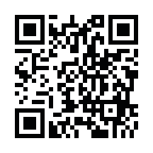
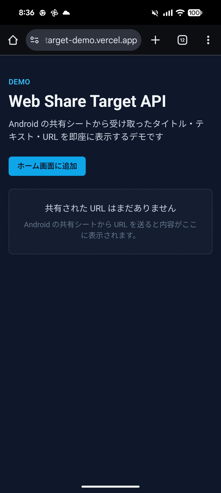

# DEMO: Web Share Target API

## 概要

Android の共有シートから渡された URL を PWA が受け取り、そのまま画面に表示するデモ用アプリケーションを提供する。

■ URL

https://share-target-demo.vercel.app/

## 技術スタック

- React + Vite + Tailwind CSS
- pwa

## 実行方法

Android 端末で以下の QR コードを読み取ると、デモアプリが起動。

 

画面のホーム画面に追加をタッチ。

以下の画面が表示されてホーム画面にアプリが追加。

適当にブラウザを開いて共有ボタンをタッチして、「Share Target API」を選択。

以下の画面が表示されて、URL を入力して送信をタッチ。

共有された URL の情報が画面にパラメータとして渡されていることが確認できる。

